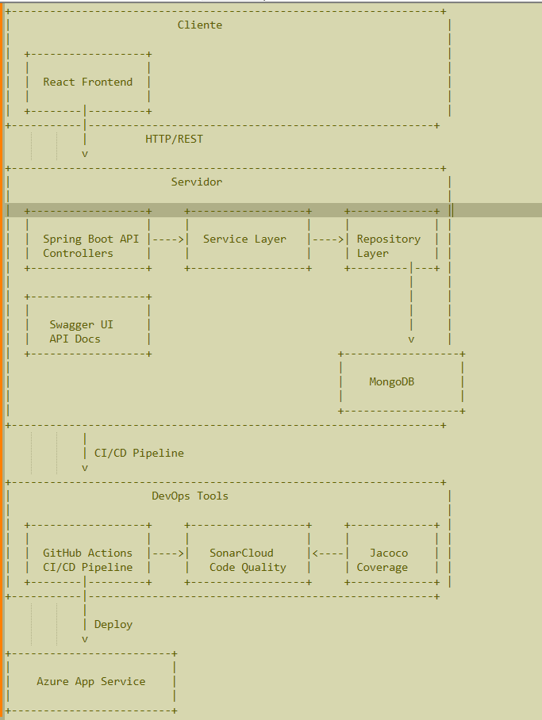
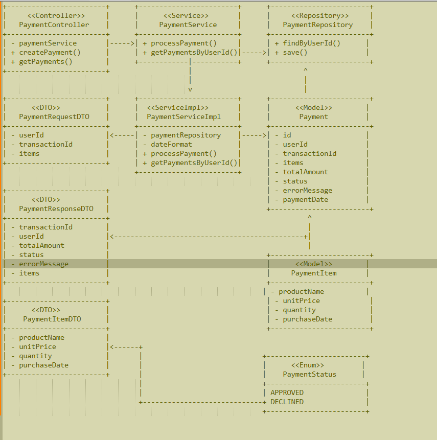
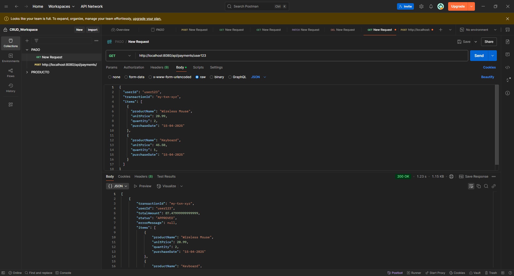
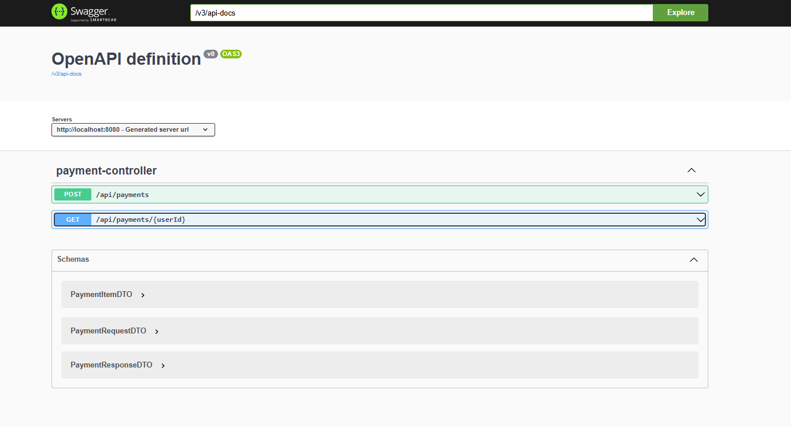
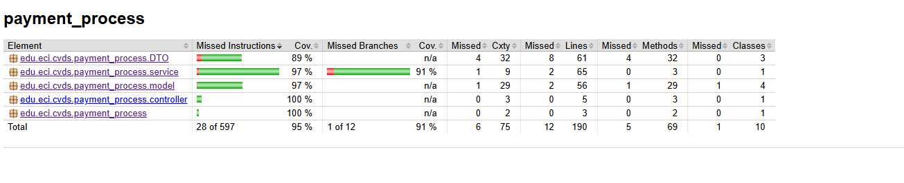
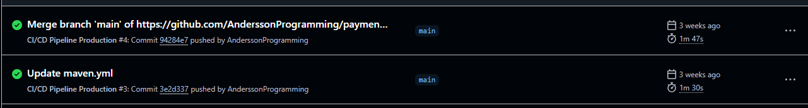
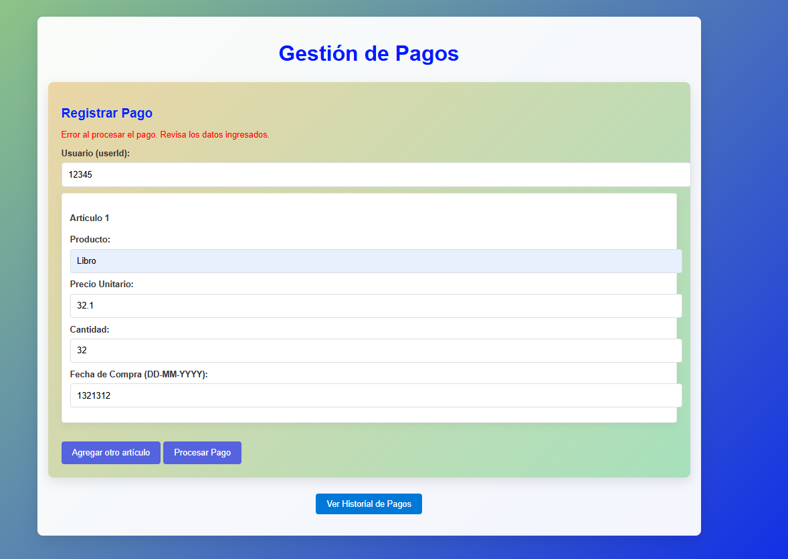
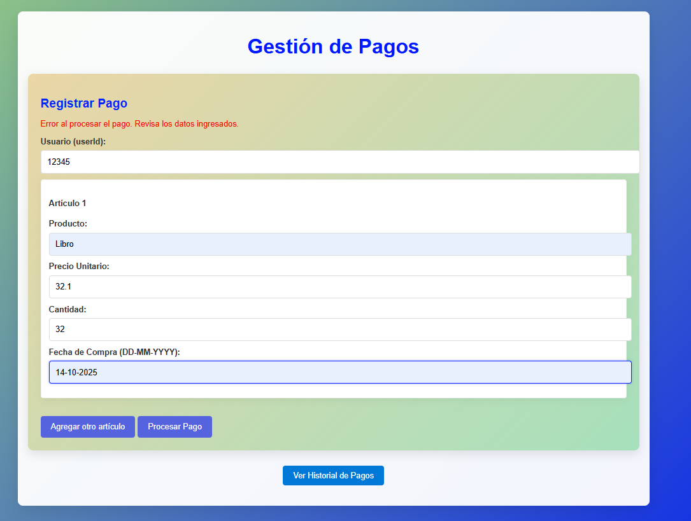
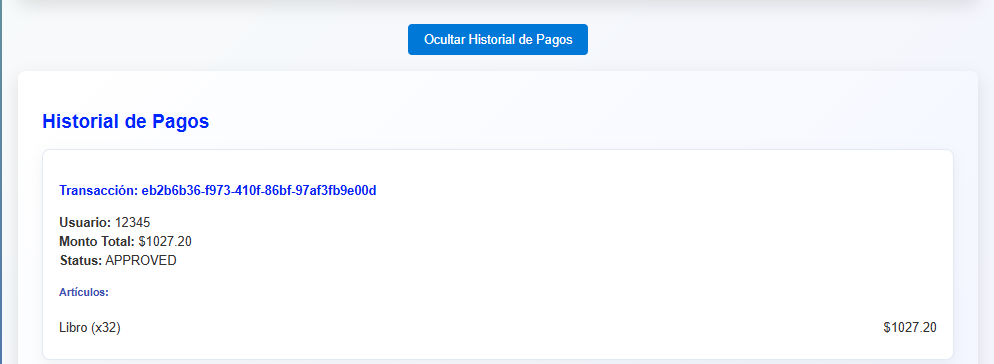

# 💳 ECICredit – Sistema de Procesamiento de Pagos

## 🧱 Arquitectura General

Este proyecto fue diseñado siguiendo los principios del ciclo de vida del desarrollo de software, usando una arquitectura modular y orientada a servicios. A continuación, se describen los principales elementos:

### 🧩 Diagrama de Componentes

- **React**: Interfaz de usuario para registrar y consultar pagos.
- **Spring Boot**: Backend que expone servicios REST para gestionar pagos.
- **MongoDB**: Base de datos NoSQL donde se persisten las transacciones.



---

### 🧩 Diagrama de Clases



---

## 🧱 Estructura de Arquitectura por Capas

Este proyecto está construido siguiendo una **arquitectura multicapa tradicional**, que favorece la separación de responsabilidades, testeo y escalabilidad. Las capas implementadas son:

### 📦 1. Modelo (`model`)

Clases que representan la estructura de la transacción y los artículos:

```java
class Payment {
  String userId;
  List<PaymentItem> items;
  double totalAmount;
  String transactionId;
  PaymentStatus status;
  String errorMessage;
  Date paymentDate;
}
```

- `PaymentItem`: contiene nombre del producto, precio unitario, cantidad y fecha de compra.
- `PaymentStatus`: Enum con valores `APROBADO`, `DECLINADO`.

---

### 🧰 2. DTO (Data Transfer Object)

Clases que **reciben y devuelven datos** en la API, desacopladas del modelo de base de datos:

- `PaymentRequestDTO`: estructura del pago que llega desde el frontend.
- `PaymentResponseDTO`: estructura de la respuesta enviada al cliente.
- `PaymentItemDTO`: representa cada artículo del pago.

> Esto evita exponer internamente el modelo de dominio y permite validar formatos y campos específicos (como la fecha `DD-MM-YYYY`).

---

### ⚙️ 3. Servicio (`service`)

Encapsula la **lógica de negocio**. Valida los datos, calcula el total, lanza excepciones, aprueba o rechaza la transacción y la guarda.

```java
if (calculatedTotal != request.getTotalAmount()) {
  throw new PaymentException("Total incorrecto.");
}
```

- Procesa pagos con `processPayment()`
- Consulta pagos con `getPaymentsByUserId()`

---

### 🧮 4. Repositorio (`repository`)

Capa encargada de hablar con la base de datos usando Spring Data MongoDB:

```java
interface PaymentRepository extends MongoRepository<Payment, String> {
  List<Payment> findByUserId(String userId);
}
```

---

### 🌐 5. Controlador (`controller`)

Exposición de la API REST:

```java
@PostMapping
public PaymentResponseDTO createPayment(@RequestBody PaymentRequestDTO request) { ... }

@GetMapping("/{userId}")
public List<PaymentResponseDTO> getPayments(@PathVariable String userId) { ... }
```

Incluye configuración `@CrossOrigin` para permitir conexiones desde React (`localhost:3000` o desde Azure).

---

## 🚀 ¿Cómo correr el proyecto localmente?

### Requisitos

- Java 17+
- Maven 3+
- MongoDB local o conexión a MongoDB Atlas

### Instrucciones

```bash
git clone https://github.com/AnderssonProgramming/payment_process.git
cd payment_process
mvn clean install
mvn spring-boot:run
```

Aplicación disponible en: [http://localhost:8080](http://localhost:8080)

---

## 🛠️ Tecnologías Usadas

| Capa        | Tecnología                  |
|-------------|-----------------------------|
| Backend     | Java 17, Spring Boot        |
| Base Datos  | MongoDB Atlas               |
| Frontend    | React.js, Styled Components|
| DevOps      | GitHub Actions, Azure App Service |
| Testing     | JUnit, Mockito, Jacoco      |
| CI/CD       | GitHub Actions              |
| Despliegue  | Azure (servicio App)        |

---

## 📦 Métodos del API

### `POST /api/payments`

**Descripción:** Procesa un nuevo pago.

**Cuerpo esperado:**

```json
{
  "userId": "usuario123",
  "items": [
    {
      "productName": "Teclado Mecánico",
      "unitPrice": 150.0,
      "quantity": 2,
      "purchaseDate": "15-04-2025"
    }
  ]
}
```

**Respuesta:**

```json
{
  "transactionId": "ABC123XYZ",
  "status": "APROBADO",
  "message": "Pago procesado con éxito",
  "totalAmount": 300.0
}
```

---

### `GET /api/payments/{userId}`

**Descripción:** Consulta todos los pagos registrados por un usuario.

**Respuesta:**

```json
[
  {
    "transactionId": "ABC123XYZ",
    "status": "APROBADO",
    "totalAmount": 300.0,
    "items": [...],
    "message": "Pago procesado con éxito"
  }
]
```





---

## 🧪 Pruebas Unitarias

- Pruebas unitarias desarrolladas con **JUnit** y **Mockito**
- Cobertura mínima garantizada del **80%** usando **Jacoco**
- Casos cubiertos:
  - Validación de fechas (formato `DD-MM-YYYY`)
  - Cálculo correcto del total
  - Manejo de errores y excepciones
  - Comprobación del flujo de estado `APROBADO`/`DECLINADO`



---

## ⚙️ CI/CD con GitHub Actions

> Despliegue automático al hacer push en `main`

### Flujo

1. Build de backend
2. Ejecución de pruebas con Jacoco
3. Despliegue automático a Azure Web App



---

## 🌐 Frontend con React

- Interfaz amigable y colorida con Styled Components
- Registro de pagos en formularios dinámicos
- Validación de campos (fecha, precio, cantidad)
- Consulta de pagos con botón interactivo
- Reinicio del formulario al registrar cada pago

### Correr localmente

```bash
npm install
npm start
```

Aplicación disponible en: [http://localhost:3000](http://localhost:3000)

---

## 📸 Evidencias

> - Registro exitoso de pago ✅
> - Validación de errores ❌
> - Consulta de historial interactiva 📄





---

## ✅ Checklist del Parcial

✔️ Diseño de arquitectura  
✔️ Métodos `pagar` y `consultar`  
✔️ Persistencia en MongoDB  
✔️ Pruebas unitarias (80% cobertura)  
✔️ CI/CD con GitHub Actions  
✔️ Backend desplegado en Azure  
✔️ Frontend con React y buena UX  
✔️ README completo con instrucciones y evidencias

---

## 👨‍💻 Autor

**Desarrollado por:**  
Andersson David Sánchez Méndez
Ingeniero de Sistemas – ECICredit MVP V1
